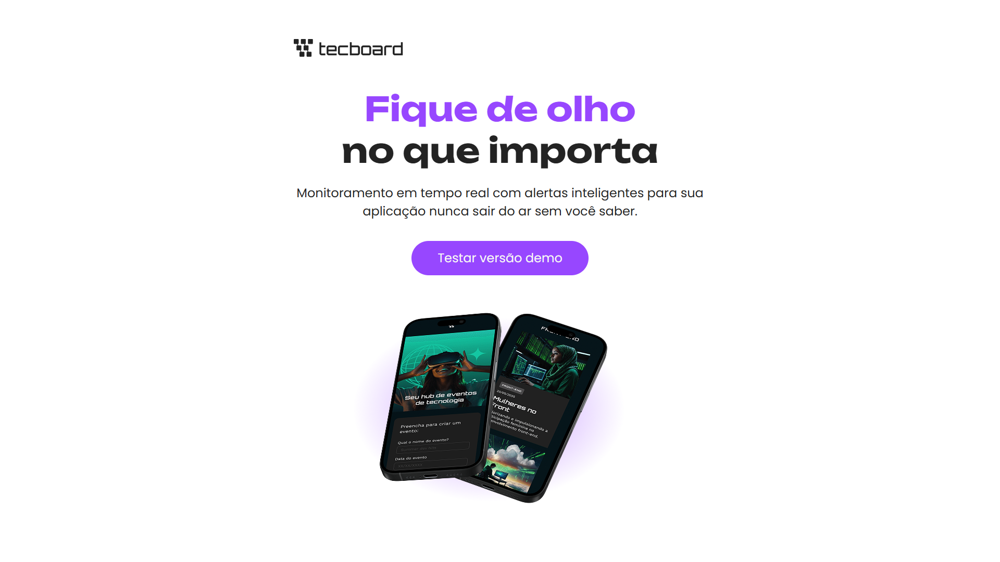

# Tecboard

Projeto desenvolvido durante o curso **HTML e CSS** da Alura com o objetivo de praticar a construção de uma landing page responsiva utilizando HTML5 e CSS3.



## 🌐 Deploy

Acesse a aplicação publicada:

**https://gui-vidall.github.io/tecboard-alura/**

## 🚀 Tecnologias utilizadas

- HTML5
- CSS3

## 📚 Conceitos praticados

Durante o desenvolvimento deste projeto foram praticados os seguintes conceitos:

- Estrutura semântica em HTML;
- Estilização com CSS;
- Responsividade com Media Queries;
- Organização de arquivos e pastas;
- Versionamento de código com Git;
- Publicação utilizando GitHub Pages.

## ▶️ Como executar

Clone este repositório:

```bash
git clone https://github.com/gui-vidall/tecboard-alura.git
```

Em seguida, abra o arquivo `index.html` em seu navegador.

## 🔄 Versão aprimorada

Após concluir o curso, desenvolvi uma versão aprimorada deste projeto aplicando boas práticas que vão além do conteúdo apresentado nas aulas, incluindo:

- HTML semântico;
- Organização utilizando a metodologia BEM;
- Melhor estruturação do CSS;
- Melhorias de responsividade.

Repositório:

https://github.com/gui-vidall/tecboard

Deploy:

https://gui-vidall.github.io/tecboard/

---

Desenvolvido por **Guilherme Vidal** durante os estudos na Alura.